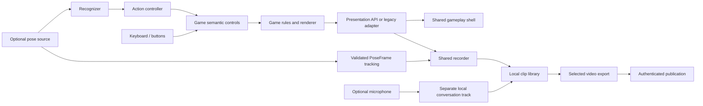

# Shared gameplay host

## Delivery boundary

- User: a developer adding a game or a player changing its input method.
- Job: plug a game into one full-window shell, replay recorder and sharing flow,
  and add movement input without putting pose recognition into game rules.
- Main risk: a generic lifecycle could lose first/final frames or own another
  module's camera/audio tracks.
- Loop: game + optional action controller → presentation adapter → shared shell
  and recorder → local replay + aligned named-joint tracking + optional conversation → selected export.
- Proof: all five existing game mounts and input paths, synthetic recording/audio
  regression, a game with no recognizer driving the same host, and source-swapping
  controller tests. No private participant recordings.
- Boundary: retain native game views and recognizers; no plugin discovery, event
  bus, backend, dependencies or recognition-contract changes.

## Layers

`shell.js` owns the viewport, home/exit link, optional microphone control and
replay area. `recording` owns automatic recording lifecycle and local persistence.
When the current round completes, its replay is revealed automatically after
saving. The shared HUD shows preparation or recording failure; a newer round
cancels the reveal. Back to game pauses replay playback and restores the game
viewport. Opening a replay never publishes or automatically plays its video.
`rolling-media.js` bounds native video and optional conversation capture to the
latest 90 seconds, then remuxes the retained packets at normal speed. It rotates
independently decodable segments and preserves a shared video/audio timeline.
Once a round reaches `playing`, the shared HUD also exposes **Stop game**. That
action releases the game runtime and owned media before showing one thumbs-up or
thumbs-down prompt. The GCP gateway records the rating with bounded session and
request facts; the browser never sends camera frames, landmarks or credentials.
Camera presentations may implement `subscribeTracking(callback)`. While a video
recording is active, the recorder stores matching validated `PoseFrame` samples
with millisecond offsets into that video. The clip UUID and camera-session UUID
remain separate. Rolling-video trimming filters and rebases the tracking window;
derived share copies slice and re-time the same sidecar without changing its
session identity. The sidecar is saved and evicted atomically with the IndexedDB
clip. Synthetic sessions still receive UUIDs but never create camera tracking.
The clip library and account sharing live outside this directory. Game rules,
rendering, model loading and calibration remain independently owned.

A live camera may briefly have no drawable video frame. Recording keeps the
last camera image and continues the same clip through these interruptions;
only fresh, drawable camera frames reset the eight-second stall deadline.
An ended camera track still finishes the partial replay immediately. Synthetic
portrait-browser regressions verify a 150 ms readiness/dimension interruption,
the decoded replay beyond six seconds, and cleanup after a real camera stop.
These checks do not establish behavior on a physical Android device.

Each entry in `apps/arcade/game-catalog.js` selects a presentation adapter. Only the four legacy adapters inspect game-specific
DOM/API shapes. Dino Run implements the native presentation API directly. The host and recorder consume `GameplayFrame`; they never switch
on game IDs. New games expose the documented presentation API directly and use
`createNativeAdapter`. All media stays same-origin and local until publication.

Action integration is separate: `packages/gameplay/input.js` validates and maps
`ActionFrame` into game commands. A game receives semantic controls (for example,
height ratio), not landmarks, model indexes or a recognizer. Dino Run is the
reference implementation; its engine can run entirely without pose contracts.

## Add a game

1. Keep your rules and renderer in the game app. Export `window.gameplay` with
   `getFrame()` returning the types in `index.d.ts`; it may return null during setup.
   Provide a UUID v4 `sessionId` per restart, use it as the presentation round ID,
   and return matching source provenance, explicit phases and references to rendered
   canvas/video/audio. `playing` begins only after permission/calibration. Keep
   `ending` until the game's final effects finish, then emit `complete`.
2. Optionally implement `subscribe(changed)` for immediate transitions. Camera
   games also implement `subscribeTracking(callback)` and publish validated,
   unmirrored named-joint PoseFrames from that same session. Polling is
   retained for older games. `configureHost({homeURL,recordingNote})` wires the
   game's home control and privacy note. Stop only your owned camera/model on
   exit. The recorder owns clones of game sound, never the game's audio source.
3. Register `{id,title,path,directory,kind:'playable',...}` in
   `apps/arcade/game-catalog.js`. Native presentation is the default. This one
   entry drives UI, standalone build mounts and server publication validation.
   A legacy app can select a named adapter in `game-adapters/`; never edit the
   recorder. New game apps need their own build command, not a model dependency.
4. Integrate input independently. Map keyboard/buttons to game commands. To add
   motion, connect a pose producer to a recognizer, then use an action controller
   to map its ActionFrames onto the same game's semantic controls. The source
   owns camera permission, calibration and teardown. Keep scoring/deduplication
   semantics from the shared contracts.
5. Verify guest entry, setup without recording, a complete round, restart, exit,
   local replay and selected conversation export. Existing login/publication is
   automatically reused from the clip library.

`getFrame()` is read-only. The host neither starts a camera nor controls the game
by scraping buttons. Mirroring and projection belong to presentation adapters;
raw recognition coordinates and source identities are never rewritten by the UI.
The native adapter does not assume any game name, global variable except the
presentation API, canvas ID, score selector or movement type.

The shared microphone control is a compact top-right icon. Gray is off, blue is
waiting/armed, and red means a live microphone is attached to an active recorder.
Its accessible name and tooltip explain the action; only errors open a status
bubble. Voice remains a separate local track. Replays play it in sync by default,
with a listening toggle; including it in downloaded/shared video remains explicit.

