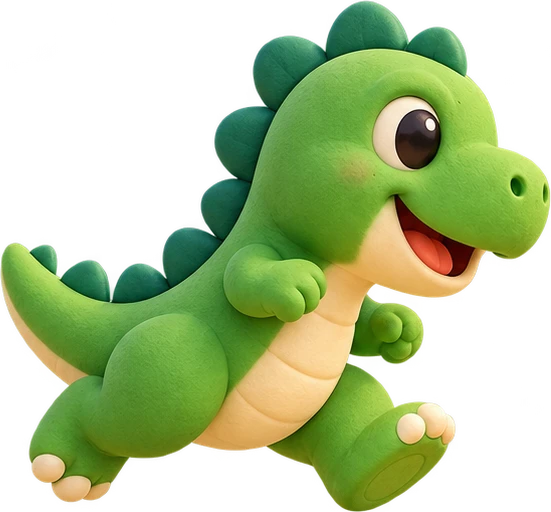
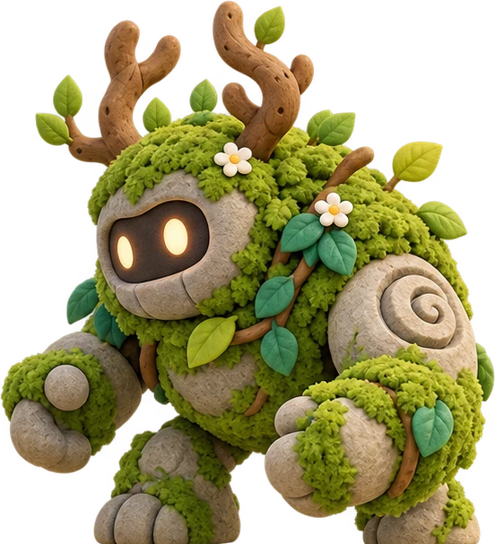
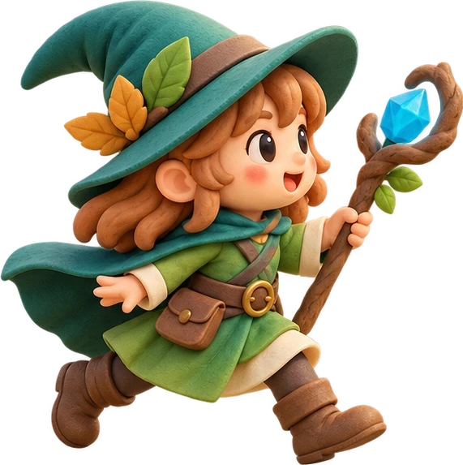
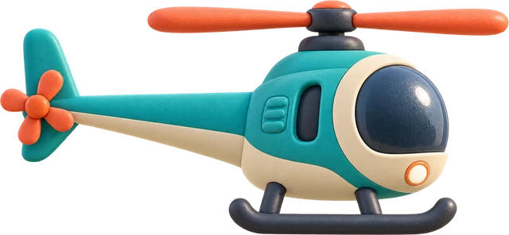

# Hopmodo game artwork

Reusable visual source material for the current games and future iterations.
Everything in this directory is public, generated game artwork; no camera or
participant recordings belong here.

| Directory | Contents | Use |
| --- | --- | --- |
| `covers/` | Ten landscape covers and their generation prompts | Cards, entries, themed references |
| `sprites/` | Transparent dinosaur, guardian, mage and side-view helicopter | Live canvas rendering |
| `sprites/*-idle/charge/cast/step/hit-v1.webp` | Six Forest Guardian action poses | State-driven character animation |
| `poses/` | Six transparent movement illustrations | Setup, confirmation and instructions |
| `source/` | Original generated atlases, helicopter and generation briefs | Re-cut, regenerate or develop variants |

[index.json](index.json) lists paths, dimensions, transparency and SHA-256 hashes.
[Source briefs](source/briefs.json) record the intended style and subjects. Cover
prompts remain in [covers/prompts.json](covers/prompts.json).

## Reuse

Use `packages/gameplay/game-covers.js`, `game-art.js` and `pose-art.js` from a host
to load the selected local assets. Vite bundles each referenced file; artwork
does not require production access. `drawGameArt` returns false while an image is
loading, so native fallback drawing remains available. Game logic, event IDs and
camera input never depend on image loading.

Keep the cream, teal and coral palette, tactile matte surfaces, warm upper-left
light and clear silhouettes. Prefer a new versioned file over replacing a
reference. Preserve transparent backgrounds for sprites. Shadows and decorative
tails are presentation; hosts retain their explicit collision geometry.

The pose figures are illustrated instructions, not recognition examples or
medical advice. Hand illustrations use the mirrored viewing convention and keep
LEFT/RIGHT text labels. Standing/jump figures, squat, raised hand, wrist aiming
and push-up figures can be reused separately. Every pose was inspected after
extraction from its source atlas.

## Current assets

The original character atlas contains the initial perspective helicopter as
well. Gameplay uses the separate side-profile version to fit the flight's
existing collision envelope. Movement figures were separated by their alpha
components because some limbs extend beyond the nominal atlas cells; do not
blindly slice that atlas into equal rectangles.

Forest Guardian now uses six poses from `source/forest-animation-v1.png`:
mage idle/charging/casting and guardian alternating strides/hit recoil. Each
selected frame uses a common 640×448 transparent canvas, bottom aligned; the
charging pose retains its shorter body height. The second walk frame was
mirrored to face the mage. `apps/motion-quest/src/character-art.js` loads these
frames. No scenery or floor is part of them.
