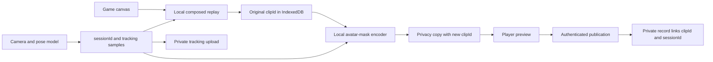

# Avatar-masked video sharing MVP

## Decision

The feature is feasible with the existing local share-copy encoder, but the current
pose sidecar is not sufficient to guarantee face coverage. `PoseFrame` contains
shoulders through ankles and intentionally omits nose, eyes and ears. The MVP must
add a model-independent head anchor, preserve the original local replay, and fail
closed whenever the privacy copy cannot cover the face.

The first slice should support one tracked person and four bundled avatars. It
should run entirely in the browser before an explicitly previewed clip is
published. It must not introduce server-side video processing or face identity.

## MVP card

- **Target user:** a camera-game player who wants to share a replay without
  showing their face.
- **User job / problem:** choose a playful preset, preview a face-covered copy,
  and publish that copy while retaining the original replay locally.
- **Riskiest assumption:** the recorded head trajectory remains aligned with the
  composed replay closely enough to cover the face for every output frame.
- **P1 end-to-end loop:** record camera game and tracking sidecar -> choose
  **Hide my face** and an avatar -> create a local privacy copy -> run coverage
  validation -> preview -> publish the privacy copy -> retrieve its private
  tracking sidecar by UUID for debugging.
- **Success proof:** a consented physical-camera trial has no uncovered-face
  frames in the complete exported copy; the original remains unchanged; the
  server can retrieve the matching private sidecar by UUID; the public clip API
  does not expose tracking data or account identity.
- **No-gos:** no face recognition, identity embeddings, raw camera upload,
  multi-person masking, server-side transcoding, arbitrary uploaded avatars, or
  claim that synthetic coverage proves real-human privacy.
- **Appetite:** one game first, one person, four presets, the existing 55-second
  local share-copy path, and the existing seven-day publication lifetime.

## Why the current implementation is close

- `apps/arcade/src/gameplay/recording.js` already composites camera, skeleton,
  game and audio into a local replay and assigns a UUID to each saved clip.
- `apps/arcade/src/share-copy.js` already decodes and re-encodes a selected local
  clip without uploading it. This is the correct place to draw an avatar onto
  each frame.
- `PoseFrame` already carries a session ID, monotonic input time, input sequence,
  source provenance and named body joints.
- Recognition Lab already demonstrates bounded skeleton capture, validation,
  IndexedDB persistence and replay with original timing.
- The sharing gateway already stores private GCS objects and publishes only a
  sanitized gallery record after an authenticated, consented upload.

The missing link is a standard, event-driven tracking stream from each camera
game to the shared recorder, plus a head anchor expressed in the final clip's
coordinate space.

## Identity and artifact relationships

Do not overload one UUID for two different lifetimes:

| Field | Created when | Meaning |
| --- | --- | --- |
| `sessionId` | camera session starts | One camera/pose session; copied into every pose sample. |
| `clipId` | one encoded video is created | One original replay or derived privacy/share copy. |
| `parentClipId` | a derived copy is created | The source video artifact, when applicable. |

Every derived clip preserves `sessionId` and records its selected time window.
The backend stores videos by `clipId` and tracking by `sessionId`; the private
publication record links both. A client-generated `crypto.randomUUID()` is
sufficient when the server validates UUID v4, rejects mismatches and uses
create-only object writes.



## Tracking envelope

Add a compatible optional `head` anchor at the pose-provider boundary; never
leak MediaPipe landmark indexes into the recorder or game. The provider can
derive it from the model's face landmarks before adapting the remaining named
body joints.

```ts
type HeadAnchor = {
  centerX: number;
  centerY: number;
  width: number;
  height: number;
  rollRadians: number;
  confidence: number | null;
};

type TrackingSample = {
  pose: PoseFrame;
  headInClip: HeadAnchor | null;
  videoMs: number;
};

type TrackingEnvelope = {
  format: 'fitness-pair/tracking-session/1';
  sessionId: string;
  createdAt: string;
  game: string;
  source: 'camera';
  samples: TrackingSample[];
};
```

`pose` stays in named, unmirrored image coordinates for recognition debugging.
`headInClip` is normalized after applying the recorder's exact mirror, cover crop,
AR layout and output-size transform. Keeping this second coordinate prevents the
privacy encoder from trying to reconstruct historical DOM geometry.

The recorder must subscribe to pose samples rather than poll `latestPose` from
`GameplayFrame`; polling can silently miss frames. Add an optional
`subscribeTracking(callback)` method to `GamePresentation` and `GameplayRuntime`.
Games without a camera return no stream. This is a compatible presentation API
addition and does not change `PoseFrame -> ActionFrame -> GameSnapshot` scoring.

Record `videoMs` from the same monotonic clock used by `PoseFrame.tMs`. When the
rolling recorder trims the start, drop earlier samples and subtract the returned
trim offset. When a 55-second copy selects another window, slice and rebase the
sidecar again.

## Face replacement

Extend the existing local share-copy encoder with an `avatar` option:

1. Draw the already-composed source video frame without mirroring it again.
2. Interpolate adjacent `headInClip` samples for the current `video.currentTime`.
3. Smooth center, scale and roll to avoid jitter while limiting lag on fast
   movement.
4. Draw the selected transparent PNG at roughly 1.5 times the measured head box,
   including the chin and side margins.
5. Encode a new clip with a new `clipId`, preserving `sessionId`, `parentClipId`
   and the rebased tracking window.
6. Require preview before the existing publish action can upload that copy.

Privacy masking must fail closed. A short missing-anchor interval may keep and
enlarge the last safe mask. A longer interval must replace the affected frame
with an opaque branded privacy frame or stop export and ask the player to choose
a different clip. Never continue encoding an uncovered camera frame. The exact
gap threshold must be selected from physical-camera evidence, not synthetic
fixtures alone.

The original local replay is never overwritten. Normal download and playback
continue to use it; only the newly created privacy copy is published or passed to
native file sharing.

## Skeleton upload and privacy boundary

"Always upload" should mean every completed real-camera session is placed in a
bounded local outbox and retried until the server acknowledges it. It must not
mean blocking gameplay or losing the replay when the network is unavailable.
Synthetic previews and replay inputs are never uploaded as camera sessions.

Add an idempotent authenticated endpoint such as
`PUT /api/tracking/:sessionId`. Validate the envelope, UUID, source, allowed
joints, monotonic sequence/time, duration, sample count and body size before a
create-only write to `tracking/<sessionId>.json`. The object remains private and
has no public download route. Operator debugging uses existing GCP IAM, not a
browser-visible admin token.

The current arcade permits guest camera play. A literal upload guarantee therefore
requires one explicit product choice before implementation:

- **Recommended:** issue a short-lived, upload-only session capability before
  camera start, keep an IndexedDB outbox, and associate the session with an
  account later if the player logs in.
- **Lower implementation cost:** require Integ.Life login before real-camera play.
  This adds substantial entry friction.

If the session-capability request fails, gameplay should remain available and the
outbox should show `Pending upload`; it can retry on the next arcade visit. Bound
pending storage and make deletion visible. The recording notice must explicitly
say that skeleton coordinates are uploaded for debugging even when the video is
not published.

Start with the same seven-day retention as a shared video, delete tracking when
the session is deleted or expires, and keep `sessionId` out of public gallery
responses. Longer debug retention should be a separate, explicit policy decision.
Skeleton coordinates are sensitive movement data even though they are not raw
camera frames.

## Server commit order

Tracking upload is independent because most sessions will never publish a video.
For a publication, use this order:

1. confirm `tracking/<sessionId>.json` exists and belongs to the upload capability
   or authenticated account;
2. reserve quota and upload `videos/<clipId>`;
3. write `gallery/<clipId>.json` last as the publication commit marker, including
   private `sessionId` and redaction metadata;
4. omit `sessionId`, tracking path and owner fields from `publicClip()`;
5. delete gallery marker, video and associated tracking according to ownership
   and retention rules.

Ambiguous writes remain reserved and owner-removable, matching the existing
gateway behavior.

## P1 implementation slices

1. **Tracking contract and capture:** add `HeadAnchor`, tracking subscription,
   aligned local envelope, validation and IndexedDB outbox for Motion Quest only.
2. **Privacy copy:** add the avatar picker and local face-covered transcode; keep
   the original; cover gaps safely; add deterministic transform tests.
3. **Private ingest:** add the idempotent tracking endpoint, upload capability,
   retention/deletion and public-field omission tests.
4. **Vertical proof:** run one consented Motion Quest recording through capture,
   mask, preview, upload, public playback and private sidecar retrieval; inspect
   the complete video, including tracking gaps and final frames.

Stop after Motion Quest proves the loop. Port the optional tracking subscription
to other games only after the first physical-camera result.

## Verification gate

- Unit: UUID propagation, monotonic validation, rolling/share-window slicing,
  coordinate transforms, interpolation and fail-closed gaps.
- Server: authorization/capability isolation, create-only writes, size/sample
  bounds, session/clip mismatch, retention/deletion, and public response omission.
- Browser: original unchanged, four presets selectable, privacy copy previewed,
  no automatic video upload, pending skeleton outbox retry, publication uses the
  derived `clipId`, and camera/model/media tracks stop normally.
- Physical camera: portrait and landscape, head turn, squat/jump, temporary pose
  loss, edge-of-frame movement, replay scrub and full exported-file inspection.

Synthetic fixtures prove alignment plumbing only. The feature cannot claim face
privacy until the complete physical-camera output has been inspected for uncovered
frames.
